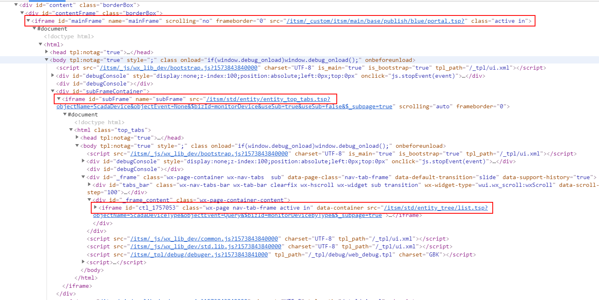

# UI自动化测试工具——Selenium入门

以下是关于Selenium工具使用的简短介绍，并对Web功能测试中可能遇到的问题给出了相应的解决方法。内容并非全部原创，整合自不同的博客文章。如有疏漏，欢迎指出。


## 相关链接

下载链接（WebDriver & Selenium IDE）：https://selenium.dev/downloads/

官方文档（中文）：https://selenium.dev/documentation/zh-cn/


## 起步——相关环境配置

### 安装Selenium库

详见官方文档的介绍：https://selenium.dev/documentation/zh-cn/selenium_installation/installing_selenium_libraries/

#### Java

使用Maven安装Selenium库，在项目中的pom.xml中添加selenium-java依赖项：

```java
<dependency>
  <groupId>org.seleniumhq.selenium</groupId>
  <artifactId>selenium-java</artifactId>
  <version>3.X</version>
</dependency>
```

如果只希望在特定浏览器（Firefox/Chrome），可以选择安装相应的依赖：

##### Firefox

```java
<dependency>
  <groupId>org.seleniumhq.selenium</groupId>
  <artifactId>selenium-firefox-driver</artifactId>
  <version>3.X</version>
</dependency>
```

##### Chrome

```java
<dependency>
  <groupId>org.seleniumhq.selenium</groupId>
  <artifactId>selenium-chrome-driver</artifactId>
  <version>3.X</version>
</dependency>
```

#### Python

使用pip安装Python的Selenium库：

```Python
python -m pip install --user selenium
```

p.s. 嫌慢的话：`python -m pip install --user selenium -i https://mirrors.aliyun.com/pypi/simple/`

p.p.s. 由于Selenium2集成了WebDriver，所以不用自己下载WebDriver安装。


## 简单示例（Python）

新建一个.py文件，将以下代码复制粘贴并运行：

```python
from selenium import webdriver

# Initialize a webdriver instance
driver = webdriver.Chrome()  # If you're using Firefox, use webdriver.Firefox()

# http/https is required
driver.get("https://www.baidu.com")

input_box = driver.find_element_by_id("kw")
input_box.send_keys("selenium")
su_btn = driver.find_element_by_id("su")
su_btn.click()

# Close the webdriver we created
driver.close()
```

可以看到，WebDriver打开了百度首页，并执行了关键词selenium的搜索，完成了一次简单的功能测试。

接下来，我们就来看看如何使用Selenium完成更复杂的操作吧。

## 定位页面中的元素

```python
input_box = driver.find_element_by_id("kw")

su_btn = driver.find_element_by_id("su")
```

完成点击、输入等操作的前提是指定对哪一个元素进行操作。Selenium提供了以下几种方式定位元素：

```python
driver.find_element_by_id("kw")
driver.find_element_by_class_name("s_ipt")
driver.find_element_by_name("wd")
driver.find_element_by_css_selector("#kw")
driver.find_element_by_xpath('//*[@id="kw"]')
driver.find_element_by_xpath("/html/body/div[2]/div[2]/div[5]/div[1]/div/form/span[1]/input")
driver.find_element_by_tag_name()
driver.find_element_by_link_text()
driver.find_element_by_partial_link_text()
```

通过选取界面中的元素（快捷键Ctrl+Shift+V）查看其相关信息，就可使用以上方法定位到该元素。

一些网站使用了动态id属性，即每次打开页面该元素的id或者class等属性是动态生成的。这种情况下，元素定位时会抛出NoSuchElementException的错误。一般看到元素属性里有拼接一串数字的，就很有可能是动态的。想要分辨，刷新一下浏览器再看该元素，属性值中的数字串改变了，即是动态属性了。

xpath提供了三个非常好的方法来为定位部分属性值：

```python
driver.find_element_by_xpath("//input[contains(@id, 'bt-class')]")  # id属性包含'bt-class'，且固定不变；
 driver.find_element_by_xpath("//input[starts-with(@id, 'bt-class')]")  # id属性开头为'bt-class'，且固定不变；
 driver.find_element_by_xpath("//input[ends-with(@id, 'bt-class')]")  # id属性结尾是'bt-class'，且固定不变；
```

或者干脆就用full xpath吧。¯\\_(ツ)_/¯

## 等待元素加载

元素未加载时会导致定位元素时程序抛出NoSuchElementException的错误。因此在功能跳转等情况下可能需要适当添加等待语句。

### 显式等待

显式等待将使WebDriver等待指定条件成立时继续执行，每隔指定时间检查一次，直到超出最长限定时间再抛出异常。

```python
from selenium import webdriver
from selenium.webdriver.common.by import By
from selenium.webdriver.support.ui import WebDriverWait
from selenium.webdriver.support import expected_conditions as EC

driver = webdriver.Firefox()
driver.get("http://www.baidu.com")

element = WebDriverWait(driver, 5, 0.5).until(EC.presence_of_element_located((By.ID, "kw")))
element.send_keys('selenium')
driver.quit()

```

WebDriverWait(driver, timeout, poll_frequency=0.5, ignored_exceptions=None)

 **driver** **：**浏览器驱动；
 **timeout** **：**最长超时时间，默认以秒为单位；
 **poll_frequency** **：**检测的间隔（步长）时间，默认为0.5S；
 **ignored_exceptions** ：超时后的异常信息，默认情况下抛NoSuchElementException异常。

### 隐式等待

driver.implicitly_wait将使WebDriver等待指定的秒数，如果元素在此期间内还没有出现在网页上，再抛出NoSuchElementException异常。

```python
from selenium import webdriver
from selenium.common.exceptions import NoSuchElementException

driver = webdriver.Chrome()

# 设置隐式等待为20秒
driver.implicitly_wait(20)
driver.get("http://www.baidu.com")

# 处理异常机制
try:
    driver.find_element_by_id("kw").send_keys('selenium')
except NoSuchElementException as e:
    print(e)
finally:
    driver.quit()
```

### 强制等待

```python
import time

time.sleep(3)  # Wait for 3 seconds
```


## 多窗口（弹窗）处理

在页面操作过程中有时点击某个链接会弹出新的窗口，这时需要切换到新打开的窗口上进行操作，或者切换到之前的窗口。WebDriver提供了switch_to.window()方法，可以实现在不同的窗口之间切换。

关于窗口句柄：[百度百科](https://baike.baidu.com/item/窗口句柄)

```python
from selenium import webdriver
import time

driver = webdriver.Chrome()
driver.implicitly_wait(10)
driver.get("http://www.baidu.com")

# 获得百度搜索窗口句柄
search_windows = driver.current_window_handle

driver.find_element_by_link_text("登录").click()
driver.find_element_by_link_text("立即注册").click()

# 获得当前所有打开的窗口的句柄
all_handles = driver.window_handles

# 进入注册窗口
for handle in all_handles:
    if handle != search_windows:
        driver.switch_to.window(handle)
        # 如果你要跳转到之前的窗口
        time.sleep(1)
        driver.switch_to.window(search_windows)
        time.sleep(1)
        driver.switch_to.window(handle)

        print("Now Register Window!")
        driver.find_element_by_id("TANGRAM__PSP_4__userName").send_keys("test")
        driver.find_element_by_id("TANGRAM__PSP_4__phone").send_keys("11111111")
        driver.find_element_by_id("TANGRAM__PSP_4__password").send_keys("123456")
        time.sleep(2)
        # 关闭当前窗口
        driver.close()
        time.sleep(1)

driver.quit()

```


## 表单嵌套（iframe）

关于什么是iframe：[MDN](https://developer.mozilla.org/zh-CN/docs/Web/HTML/Element/iframe) [w3school](https://www.w3school.com.cn/tags/tag_iframe.asp)

以及它能干什么：[知乎问答](https://www.zhihu.com/question/20653055)

在Web应用中经常会遇到iframe/frame表单嵌套页面的应用，WebDriver只能在一个页面上对元素识别与定位，对于iframe/frame表单内嵌页面上的元素无法直接定位。这时就需要通过switch_to.frame()方法将当前定位的主体切换为iframe/frame表单的内嵌页面中。

以下是一个三层表单嵌套的例子：



通过以下操作即可跳到subFrame：

```python
driver.switch_to.frame("mainFrame")  # 输入iframe/frame的name属性
driver.switch_to.frame("subFrame")
```

switch_to.frame()方法通过表单的id或name属性进行定位。但是有时iframe/frame没有可用的id和name属性值，那么这时候我们可以根据以下方式进行元素定位：

```python
from selenium import webdriver

driver = webdriver.Chrome()
driver.get("https://www.testlcass.cn")

# 先通过xpath定位到iframe
main = driver.find_element_by_xpath('//*[@name="main"]')

# 再将定位对象传给switch_to.frame()方法
driver.switch_to.frame(main)
……
driver.switch_to.parent_frame()  # 切换到上一层的frame，对于层层嵌套的frame很有用

```

p.s. driver.switch_to.default_content()方法可以切换到最外层。

## 鼠标键盘操作

拿鼠标悬浮这一操作举例吧。有些网页的下拉菜单只有鼠标悬停时才会出现，这个时候就需要使用move_to_element()方法了：

```python
from selenium import webdriver
# 引入ActionChains 类
from selenium.webdriver.common.action_chains import ActionChains
import time

driver = webdriver.Chrome()
driver.get("https://www.baidu.cn")

# 定位到要悬停的元素
above = driver.find_element_by_link_text("设置")
# 对定位到的元素执行鼠标悬停操作
ActionChains(driver).move_to_element(above).perform()
time.sleep(1)
elem = driver.find_element_by_link_text("搜索设置")
elem.click()
time.sleep(3)

driver.quit()
```

使用ActionChains还能实现一些其他操作，如：

```python
ActionChains(driver).context_click()  # 右键点击
ActionChains(driver).double_click()  # 双击
ActionChains(driver).drag_and_drop()  # 拖拽
ActionChains(driver).key_down()  # 按下键盘上的某个键
ActionChains(driver).key_up()  # 松开某个键
```

对其他操作感兴趣的同学可以参考这篇博客：[Python selenium —— 模拟鼠标键盘操作(ActionChains)](https://huilansame.github.io/huilansame.github.io/archivers/mouse-and-keyboard-actionchains)

## 元素不唯一

```python
from selenium import webdriver
import time

driver = webdriver.Chrome()
driver.implicitly_wait(10)
driver.get("https://www.baidu.com/")
driver.maximize_window()

# 定位一组元素
elements=driver.find_elements_by_name("tj_settingicon")
print(len(elements))

# 循环打印出每个元素的属性值
for i in range(len(elements)):
    print("第" + str(i) + "个元素")
    print(elements[i].get_attribute("name"))
    print(elements[i].get_attribute("class"))

```

p.s. 其实无论用什么方法定位元素，都可以先用这种方法定位后检查列表的长度是否为1。

## JavaScript操纵元素属性

```python
from selenium import webdriver
import time

driver = webdriver.Chrome()
driver.implicitly_wait(10)
driver.get("http://www.baidu.com")

# 修改display属性为'none',把"更多产品"功能按钮隐藏
js = "document.getElementsByName('tj_briicon')[0].style.display='none';"
# 调用js脚本
driver.execute_script(js)
time.sleep(5)

# 修改display属性为'block',把"更多产品"功能按钮显示
js = "document.getElementsByName('tj_briicon')[0].style.display='block';"
# 调用js脚本
driver.execute_script(js)

# 判断元素是否在页面上可见
element = driver.find_element_by_name("tj_briicon")
print(element.is_displayed)
driver.find_element_by_name("tj_briicon").click()

```

## 警告提示处理（Alert）

网页有时会弹出信息提示，比如提醒用户更改密码成功，或者确认某一步操作，比如下图：


使用driver.switch_to.alert即可对alert进行相关操作：

```python
# 点击alert的取消按钮
driver.switch_to.alert.dismiss()
# 点击alert的确定按钮
driver.switch_to.alert.accept()
# 获取alert的提示信息
print(driver.switch_to.alert.text)
# 填写alert中的输入框
driver.switch_to.alert.send_keys()
```

如果你想练练手：[http://demo.guru99.com/popup.php ](http://demo.guru99.com/popup.php)


到目前为止，Web功能测试中常见的问题（我遇到过以及能想到的）与解决方法已经介绍完毕了。想必你也已经对Selenium的强大功能有了一定了解。仍有很多使用方法在这里没有提及，如Cookie处理、User-agent替换等。除了百度，也可参阅[selenium的其它使用方法](https://juejin.im/post/5d9062d8518825192d46e17e)。

关于本介绍内容还有什么疑问欢迎提Issue，或者通过邮箱 sunjialongi@163.com联系我。